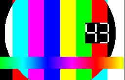
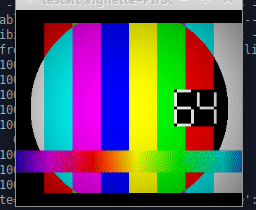
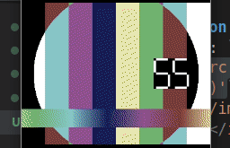
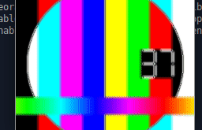
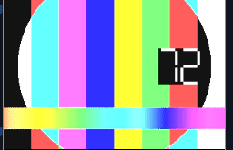
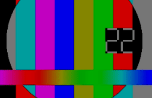

# Video Artifacts

## raw
**command**: ```ffplay -f lavfi testsrc```

</img>

## flicker
**command**: ```ffplay -f lavfi testsrc,vignette='PI/30+random(10)*PI/5':eval=frame```

</img>

## noise
**command**: ```ffplay -f lavfi testsrc,noise=c0s=90:allf=t```

</img>

## saturation
**command**: ```ffplay -f lavfi testsrc,hue='s=sin(2*PI*t^0.5)'```

</img>

## blur
**command**: ```ffplay -f lavfi testsrc,unsharp=7:7:-2:7:7:-2```

</img>

## bright
**command**: ```ffplay -f lavfi testsrc,lutyuv='y=2*val'```

</img>

## dark
**command**: ```ffplay -f lavfi testsrc,lutyuv='y=val/2'```

</img>

