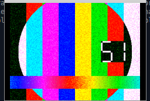

# Video Artifacts

## raw
**command**: ```ffplay -f lavfi testsrc```

</img>

## flicker
**command**: ```ffplay -f lavfi testsrc,vignette='PI/30+random(10)*PI/5':eval=frame```

</img>

## noise
**command**: ```ffplay -f lavfi testsrc,noise=c0s=90:allf=t```

</img>

</img>

- Good saperation between random noise, flicker and raw
- flicker variance is high

## saturation
**command**: ```ffplay -f lavfi testsrc,hue='s=sin(2*PI*t^0.5)'```

</img>

</img>

- The sine signal is visable!

## blur
**command**: ```ffplay -f lavfi testsrc,unsharp=7:7:-2:7:7:-2```

</img>

## bright
**command**: ```ffplay -f lavfi testsrc,lutyuv='y=2*val'```

</img>

</img>

## dark
**command**: ```ffplay -f lavfi testsrc,lutyuv='y=val/2'```

</img>

## snippet for playing with multiple artifacts
```bash
ffplay -f lavfi -i testsrc -vf "split=4[a][b][c][d];[b]vignette='PI/30+random(10)*PI/5':eval=frame[x];[c]noise=c0s=90:allf=t[y];[d]hue='s=sin(2*PI*t^0.5)'[z];[a][x][y][z]hstack=4"
```
